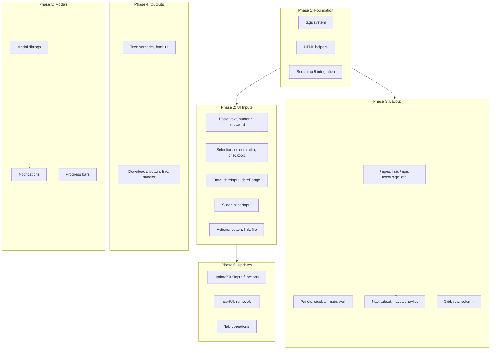

# Full Shiny UI API Implementation for hotShiny

This plan implements ~100+ Shiny UI functions organized into 6 phases, starting with the HTML tag foundation and prioritizing UI inputs as requested.

## Architecture Overview



## File Structure

New files to create:

- [`R/ui/tags.R`](R/ui/tags.R) - HTML tag system foundation
- [`R/ui/inputs.R`](R/ui/inputs.R) - All input functions  
- [`R/ui/outputs.R`](R/ui/outputs.R) - Output functions
- [`R/ui/layout.R`](R/ui/layout.R) - Layout functions
- [`R/ui/navigation.R`](R/ui/navigation.R) - Tab/navbar/navlist
- [`R/ui/modals.R`](R/ui/modals.R) - Modals, notifications, progress
- [`R/ui/updates.R`](R/ui/updates.R) - Update functions
- [`R/ui/dynamic.R`](R/ui/dynamic.R) - insertUI, removeUI
- [`inst/www/bootstrap5/`](inst/www/bootstrap5/) - Bootstrap 5 CSS/JS
- [`inst/www/inputs.js`](inst/www/inputs.js) - Client-side input handlers

Modified files:

- [`R/app.R`](R/app.R) - Update render_ui to use new tag system
- [`inst/www/hotshiny.js`](inst/www/hotshiny.js) - Add handlers for new inputs
- [`NAMESPACE`](NAMESPACE) - Export all new functions

---

## Phase 1: Foundation - HTML Tags System

Create a proper `tags` object and HTML helper infrastructure that all other functions build upon.

### Core Tag System (`R/ui/tags.R`)

```r
# Tag object structure matching Shiny's shiny.tag class
tag <- function(name, attribs = list(), children = list()) {
  structure(
    list(name = name, attribs = attribs, children = children),
    class = c("shiny.tag", "list")
  )
}

# tags$xxx generator
tags <- local({
  makeTag <- function(name) {
    function(...) {
      args <- list(...)
      # Separate named (attributes) from unnamed (children)
      ...
    }
  }
  
  tagNames <- c("a", "abbr", "address", "area", "article", "aside", "audio",
                "b", "base", "bdi", "bdo", "blockquote", "body", "br", "button",
                "canvas", "caption", "cite", "code", "col", "colgroup", "data",
                "datalist", "dd", "del", "details", "dfn", "dialog", "div", "dl",
                "dt", "em", "embed", "fieldset", "figcaption", "figure", "footer",
                "form", "h1", "h2", "h3", "h4", "h5", "h6", "head", "header",
                "hgroup", "hr", "html", "i", "iframe", "img", "input", "ins",
                "kbd", "label", "legend", "li", "link", "main", "map", "mark",
                "menu", "meta", "meter", "nav", "noscript", "object", "ol",
                "optgroup", "option", "output", "p", "param", "picture", "pre",
                "progress", "q", "rp", "rt", "ruby", "s", "samp", "script",
                "section", "select", "slot", "small", "source", "span", "strong",
                "style", "sub", "summary", "sup", "table", "tbody", "td",
                "template", "textarea", "tfoot", "th", "thead", "time", "title",
                "tr", "track", "u", "ul", "var", "video", "wbr")
  
  lapply(setNames(tagNames, tagNames), makeTag)
})
```

### Helper Functions

- `tagList(...)` - Combine multiple tags
- `tagAppendAttributes(tag, ...)` - Add attributes to tag
- `tagAppendChild(tag, child)` / `tagAppendChildren(tag, ...)`
- `tagSetChildren(tag, ...)` - Replace children
- `tagGetAttribute(tag, attr)` / `tagHasAttribute(tag, attr)`
- `HTML(text)` - Mark text as raw HTML
- `validateCssUnit(x)` - Validate CSS units
- `withTags(expr)` - Evaluate expression with tags in scope
- `p()`, `h1()`-`h6()`, `a()`, `br()`, `div()`, `span()`, `pre()`, `code()`, `img()`, `strong()`, `em()`, `hr()` - Direct tag functions

### Include Functions

- `includeHTML(path)` - Include raw HTML file
- `includeText(path)` - Include text file
- `includeMarkdown(path)` - Include markdown (render to HTML)
- `includeCSS(path)` - Include CSS file
- `includeScript(path)` - Include JavaScript file

### Bootstrap 5 Integration

- Download Bootstrap 5.3 CSS/JS to `inst/www/bootstrap5/`
- `bootstrapLib()` - Return Bootstrap dependencies
- Update `render_ui()` to include Bootstrap 5 in HTML head

---

## Phase 2: UI Inputs (Priority)

All input functions follow pattern: return a tag structure with `data-input-id` attribute for client binding.

### Basic Inputs (`R/ui/inputs.R`)

| Function | Description |

|----------|-------------|

| `textInput(inputId, label, value, width, placeholder)` | Text input |

| `textAreaInput(inputId, label, value, width, height, cols, rows, placeholder, resize)` | Multi-line text |

| `passwordInput(inputId, label, value, width, placeholder)` | Password input |

| `numericInput(inputId, label, value, min, max, step, width)` | Numeric input |

### Selection Inputs

| Function | Description |

|----------|-------------|

| `selectInput(inputId, label, choices, selected, multiple, selectize, width, size)` | Dropdown select |

| `selectizeInput(inputId, label, choices, selected, multiple, options)` | Selectize.js enhanced |

| `varSelectInput(inputId, label, data, selected, multiple, selectize, width, size)` | Variable selector |

| `radioButtons(inputId, label, choices, selected, inline, width, choiceNames, choiceValues)` | Radio buttons |

| `checkboxInput(inputId, label, value, width)` | Single checkbox |

| `checkboxGroupInput(inputId, label, choices, selected, inline, width, choiceNames, choiceValues)` | Checkbox group |

### Date Inputs

| Function | Description |

|----------|-------------|

| `dateInput(inputId, label, value, min, max, format, startview, weekstart, language, width, autoclose, datesdisabled, daysofweekdisabled)` | Date picker |

| `dateRangeInput(inputId, label, start, end, min, max, format, startview, weekstart, language, separator, width, autoclose)` | Date range picker |

### Slider Input

| Function | Description |

|----------|-------------|

| `sliderInput(inputId, label, min, max, value, step, round, ticks, animate, width, sep, pre, post, timeFormat, timezone, dragRange)` | Slider with optional animation |

| `animationOptions(interval, loop, playButton, pauseButton)` | Animation config for slider |

### Action Inputs

| Function | Description |

|----------|-------------|

| `actionButton(inputId, label, icon, width, ...)` | Clickable button |

| `actionLink(inputId, label, icon, ...)` | Clickable link |

| `submitButton(text, icon, width)` | Form submit button |

| `fileInput(inputId, label, multiple, accept, width, buttonLabel, placeholder, capture)` | File upload |

### Client-Side JavaScript (`inst/www/inputs.js`)

Handle all new input types:

- Slider binding (use noUiSlider or native range)
- Date picker binding (use native date or flatpickr)
- Selectize initialization
- File upload handling
- Action button click counting
- Checkbox/radio change events

---

## Phase 3: Layout Functions

### Page Functions (`R/ui/layout.R`)

| Function | Description |

|----------|-------------|

| `fluidPage(...)` | Fluid width page with Bootstrap container-fluid |

| `fluidRow(...)` | Row in fluid grid |

| `fixedPage(...)` | Fixed width page with Bootstrap container |

| `fixedRow(...)` | Row in fixed grid |

| `fillPage(...)` | Page that fills viewport |

| `bootstrapPage(...)` / `basicPage(...)` | Minimal Bootstrap page |

### Panel Functions

| Function | Description |

|----------|-------------|

| `sidebarLayout(sidebarPanel, mainPanel, position, fluid)` | Sidebar + main layout |

| `sidebarPanel(...)` | Sidebar content panel |

| `mainPanel(...)` | Main content panel |

| `wellPanel(...)` | Inset panel with gray background |

| `absolutePanel(...)` / `fixedPanel(...)` | Absolutely positioned panel |

| `conditionalPanel(condition, ...)` | Show/hide based on JS condition |

| `inputPanel(...)` | Panel for inputs |

| `titlePanel(title, windowTitle)` | Page title |

| `helpText(...)` | Help/hint text |

### Grid Functions

| Function | Description |

|----------|-------------|

| `column(width, ..., offset)` | Column in grid (1-12) |

| `flowLayout(...)` | Flexible flow layout |

| `splitLayout(...)` | Split into equal parts |

| `verticalLayout(...)` | Vertical stacking |

| `fillRow(...)` / `fillCol(...)` | Flexbox row/column |

### Special

| Function | Description |

|----------|-------------|

| `icon(name, class, lib)` | FontAwesome/Glyphicon icon |

| `withMathJax(...)` | Load MathJax for LaTeX |

---

## Phase 4: Navigation (`R/ui/navigation.R`)

| Function | Description |

|----------|-------------|

| `tabsetPanel(...)` | Tabbed panel container |

| `tabPanel(title, ..., value, icon)` | Individual tab |

| `tabPanelBody(value, ...)` | Tab body without header |

| `navbarPage(title, ..., id, selected, position, header, footer, inverse, collapsible, fluid, responsive, theme, windowTitle, lang)` | Top navigation bar page |

| `navbarMenu(title, ..., menuName, icon)` | Dropdown in navbar |

| `navlistPanel(...)` | Vertical navigation list |

---

## Phase 5: Outputs & Modals

### Output Functions (`R/ui/outputs.R`)

| Function | Description |

|----------|-------------|

| `textOutput(outputId, container, inline)` | Text output |

| `verbatimTextOutput(outputId, placeholder)` | Preformatted text (code) |

| `htmlOutput(outputId, ...)` / `uiOutput(outputId, ...)` | Raw HTML output |

| `plotOutput(outputId, width, height, click, dblclick, hover, brush, inline)` | Plot output |

| `imageOutput(outputId, width, height, click, dblclick, hover, brush, inline)` | Image output |

| `tableOutput(outputId)` | Static table |

| `dataTableOutput(outputId, icon)` | DataTables.js table |

| `downloadButton(outputId, label, class, icon, ...)` | Download button |

| `downloadLink(outputId, label, class, icon, ...)` | Download link |

| `outputOptions(x, name, ...)` | Set output options |

### Render Functions (extend existing in `R/core/render.R`)

| Function | Description |

|----------|-------------|

| `renderPrint(expr, ...)` | Render print output |

| `renderImage(expr, ...)` | Render image file |

| `renderCachedPlot(expr, cacheKeyExpr, ...)` | Cached plot rendering |

| `downloadHandler(filename, content, contentType, outputArgs)` | Handle downloads |

| `createRenderFunction(func, ...)` | Create custom render function |

### Modal Functions (`R/ui/modals.R`)

| Function | Description |

|----------|-------------|

| `modalDialog(...)` | Create modal dialog UI |

| `modalButton(label, icon)` | Button that closes modal |

| `showModal(ui, session)` | Display modal |

| `removeModal(session)` | Close modal |

| `urlModal(url, title, subtitle)` | Modal with URL |

### Notification Functions

| Function | Description |

|----------|-------------|

| `showNotification(ui, action, duration, closeButton, id, type, session)` | Show notification |

| `removeNotification(id, session)` | Remove notification |

### Progress Functions

| Function | Description |

|----------|-------------|

| `Progress` | R6 class for progress |

| `withProgress(expr, min, max, value, message, detail, style, session, env, quoted)` | Wrap code with progress |

| `setProgress(value, message, detail, session)` | Set progress |

| `incProgress(amount, message, detail, session)` | Increment progress |

---

## Phase 6: Update Functions (`R/ui/updates.R`)

All update functions send WebSocket messages to modify inputs client-side.

| Function | Updates |

|----------|---------|

| `updateTextInput(session, inputId, label, value, placeholder)` | textInput |

| `updateTextAreaInput(session, inputId, label, value, placeholder)` | textAreaInput |

| `updateNumericInput(session, inputId, label, value, min, max, step)` | numericInput |

| `updateSelectInput(session, inputId, label, choices, selected)` | selectInput |

| `updateSelectizeInput(session, inputId, label, choices, selected, options, server)` | selectizeInput |

| `updateCheckboxInput(session, inputId, label, value)` | checkboxInput |

| `updateCheckboxGroupInput(session, inputId, label, choices, selected, inline, choiceNames, choiceValues)` | checkboxGroupInput |

| `updateRadioButtons(session, inputId, label, choices, selected, inline, choiceNames, choiceValues)` | radioButtons |

| `updateDateInput(session, inputId, label, value, min, max)` | dateInput |

| `updateDateRangeInput(session, inputId, label, start, end, min, max)` | dateRangeInput |

| `updateSliderInput(session, inputId, label, value, min, max, step, timeFormat, timezone)` | sliderInput |

| `updateActionButton(session, inputId, label, icon, disabled)` | actionButton |

| `updateActionLink(session, inputId, label, icon)` | actionLink |

| `updateTabsetPanel(session, inputId, selected)` | tabsetPanel |

| `updateNavbarPage(session, inputId, selected)` | navbarPage |

| `updateNavlistPanel(session, inputId, selected)` | navlistPanel |

| `updateQueryString(queryString, mode, session)` | Browser URL |

| `getQueryString(session)` / `getUrlHash(session)` | Read URL |

### Dynamic UI (`R/ui/dynamic.R`)

| Function | Description |

|----------|-------------|

| `insertUI(selector, where, ui, multiple, immediate, session)` | Insert UI into page |

| `removeUI(selector, multiple, immediate, session)` | Remove UI from page |

| `insertTab(inputId, tab, target, position, select, session)` | Insert tab |

| `prependTab(inputId, tab, select, session)` | Prepend tab |

| `appendTab(inputId, tab, select, session)` | Append tab |

| `removeTab(inputId, target, session)` | Remove tab |

| `showTab(inputId, target, select, session)` | Show hidden tab |

| `hideTab(inputId, target, session)` | Hide tab |

---

## Implementation Notes

1. **Tag System**: All UI functions return `shiny.tag` objects. The `ui_to_html()` method in `app.R` will be updated to handle these properly.

2. **Bootstrap 5 Migration**: Bootstrap 5 uses different class names (e.g., `form-control` instead of `form-control`, `btn-close` instead of `close`). Grid system is similar but uses `row-cols-*` for responsive columns.

3. **Client Bindings**: Each input type needs JavaScript binding code to:

   - Initialize the input (for complex inputs like datepicker, selectize)
   - Send value changes to server via WebSocket
   - Handle updates from server

4. **Session Object**: Update functions require a session object. This will be enhanced to support message sending to specific clients.

5. **NAMESPACE Updates**: All ~100 functions will need to be exported.

---

## Estimated Effort

| Phase | Functions | Complexity |

|-------|-----------|------------|

| Phase 1: Foundation | ~25 | Medium |

| Phase 2: Inputs | ~20 | High |

| Phase 3: Layout | ~25 | Medium |

| Phase 4: Navigation | ~8 | Medium |

| Phase 5: Outputs/Modals | ~20 | High |

| Phase 6: Updates | ~25 | Medium |

Total: ~123 functions

This is a large implementation. I recommend we proceed phase by phase, testing each before moving to the next.